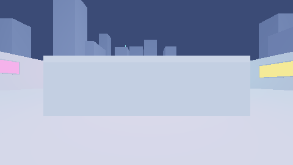
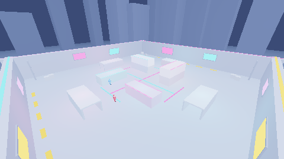

<div align="center">

# IMPACT VELOCITY

**A kinetic browser FPS in a single HTML file.**

[](https://kodiakthebear.github.io/impact-velocity/)
[](LICENSE)


*Titanfall-inspired movement · CoD-style Killstreaks*

</div>

---

## 🎮 Play it

**[kodiakthebear.github.io/impact-velocity](https://kodiakthebear.github.io/impact-velocity/)** — or download `index.html` and open it in Chrome/Firefox. Pointer lock needs a real browser tab (not an embedded preview). [LINK NOT OPERATIONAL AS OF YET]

## ✨ What's in the box

- **Movement-first gunplay** — sprint, momentum slides, slide-hops, air-strafing, dash, and a physics grapple. Speed is the meta.
- **The killstreak ladder**

  | Streak | Reward |
  |:------:|--------|
  | 3 | 🪝 **Grapple Hook** — pendulum physics, permanent until death |
  | 5 | 📡 **UAV** — live minimap, all hostiles marked |
  | 10 | 🤠 **Gunslinger** `[G]` — one-shot six-shooter · 🔥 **Rain Hell** `[H]` — napalm on the whole map |
  | 15 | ⚔️ **SABRE SURPRISE** — 60s of wall-running, wall-jumps and a pulsing one-hit katana. +5s per kill. |

- **The arsenal**

  | Slot | Weapon | Character |
  |------|--------|-----------|
  | SMG | **MP-X NOVA** | sci-fi MP5, cyan glow strips, 920 rpm |
  | AR | **MASADA AR** | ACR silhouette, the all-rounder |
  | Shotgun | **W-1887** | lever-action, full Terminator 2 flip-cock after every shot |
  | Sniper | **BARRETT .50** | huge, loud, one-tap to the chest |
  | Sidearm | **P-45** + knife | always with you |

- **Skull-faced military bots** with glowing eyes, articulated limbs, multi-part ragdolls, bone-chip gore and the actual Wilhelm scream.
- **Ammo economy** — 30/250 pools, corpses drop crates: **+15** reserve from enemies, **+30** from teammates.
- **Reload theatre** — AR/SMG reloads flick-toss the empty mag (it bounces on the floor), flip the fresh one in-hand, and jam it home.
- **All audio is synthesized at runtime** — layered gunshots through convolution reverb, a 90s-arcade announcer ("you just earned Rain Hell"), and an original dark synthwave loop in the menus only. Zero audio files shipped.
- **Modes** — FFA vs bots, TDM vs bots. Online netcode is on the roadmap.

## 🕹️ Controls

| Input | Action |
|-------|--------|
| `WASD` / `Shift` / `Space` | move / sprint / jump |
| `C` | slide (chain into slide-hops) |
| `Q` | dash |
| `LMB` / `RMB` / `R` | fire / ADS / reload |
| `1` `2` `3` `V` | primary / pistol / katana (Sabre) / knife |
| `E` | grapple (streak 3+) |
| `G` / `H` | Gunslinger / Rain Hell (streak 10+) |

## 🏗️ How it's built

One file. `index.html` contains the renderer, physics, AI, audio engine and UI — ~1,800 lines of vanilla JS on top of [three.js r128](https://threejs.org/) from CDN.

- **Rendering** — PBR voxel art: `MeshStandardMaterial`, ACES filmic tone mapping, soft shadow-mapped moonlight, emissive neon, procedural skyline and star field.
- **Physics** — swept AABB, axis-separated resolution requiring true penetration (see [CHANGELOG](CHANGELOG.md) for the war story), Quake-style air acceleration.
- **Audio** — Web Audio synthesis only: layered noise/oscillator gunshots, procedural impulse-response reverb, TTS announcer, generative synthwave.

## 🧪 Verification tools

The `tools/` harnesses extract code **from the live `index.html`** — they always test what ships.

```bash
cd tools && npm install
npm run render    # CPU-raytraces the actual map → eye.png / high.png
npm run physics   # 9 collision regression tests on the real moveBody/resolveAxis
```

| Eye level | High angle |
|:---:|:---:|
|  |  |

<sub>Headless raytrace renders of the shipped map geometry — the lighting sanity check that caught the void-map bug.</sub>

## 🗺️ Roadmap

- [ ] WebSocket netcode: authoritative server, client prediction, lag compensation
- [ ] Real online FFA / TDM
- [ ] Second map + killcam + match stats
- [ ] Controller support
- [ ] Wave-based solo survival mode

## 🙏 Credits

- [three.js](https://threejs.org/) (MIT) — loaded from cdnjs
- Wilhelm scream — streamed at runtime from [Wikimedia Commons](https://commons.wikimedia.org/wiki/File:Wilhelm_Scream.ogg); a synthesized fallback plays offline
- Everything else — geometry, audio, music — is generated in code

## 📄 License

[MIT](LICENSE) © 2026 Mukund Ranjan Tiwari
